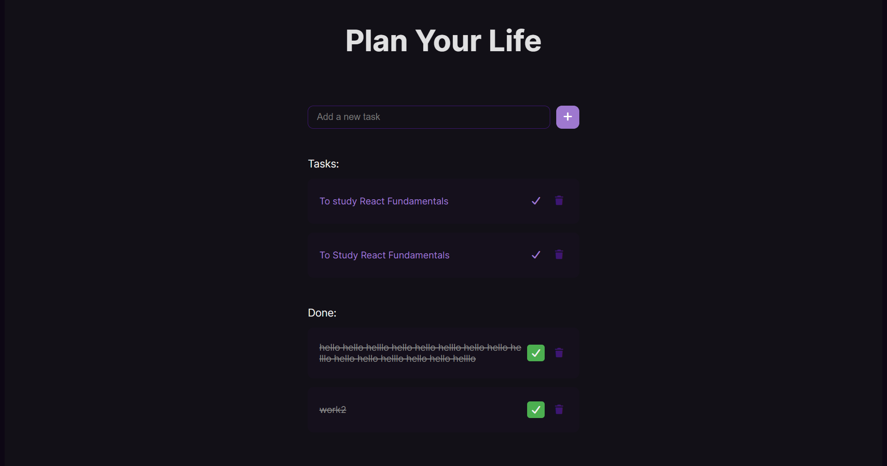

# 🚀 React To-Do App

This is a feature-rich to-do list application built with React. It was built as the first project in my intensive React learning plan, focusing on moving from basic concepts to a fully functional, interactive, and persistent application.



## ✨ Features

* **Add & Delete:** Quickly add and delete tasks.
* **Mark as Done:** Toggle tasks between "Pending" and "Done" lists.
* **Drag & Drop:** Re-order tasks within their lists using `@dnd-kit`.
* **Persistent Storage:** All tasks are saved to the browser's `localStorage`, so your data is saved even after you refresh the page.
* **Responsive Design:** A clean, responsive UI that works on both desktop and mobile.

## 🧠 What I Learned

This project was a deep dive into the core concepts of React and how they work together.

* **Core React Hooks:**
    * **`useState`:** For managing all application state, including the task list and the new task input.
    * **`useEffect`:** To create "side effects" that save or load tasks from `localStorage` whenever the `tasks` state changes.

* **Component-Based Architecture:**
    * Breaking the app down into reusable components (`TaskForm`, `TaskList`, `TaskItem`).
    * Passing data from parent to child using **Props**.

* **Data Flow & Event Handling:**
    * "Lifting State Up" by managing the main `tasks` array in the top-level `App.jsx` component.
    * Passing event handler functions (like `onDelete`, `onToggle`) down as props to child components.
    * Conditionally rendering two separate lists (Pending vs. Done) from a single source of truth (the `tasks` array).

* **Integrating Third-Party Libraries:**
    * Installing and configuring `@dnd-kit/core` and `@dnd-kit/sortable` to enable drag-and-drop reordering.
    * **Problem-Solving:** Debugging the common and tricky conflict where `dnd-kit`'s drag listeners block `onClick` events on buttons. This was solved by creating a dedicated "drag handle" for each task.

## 🛠️ How to Run

1.  Clone the repository:
    ```bash
    git clone [https://github.com/YOUR_USERNAME/YOUR_REPO_NAME.git](https://github.com/YOUR_USERNAME/YOUR_REPO_NAME.git)
    ```
2.  Navigate to the project directory:
    ```bash
    cd YOUR_REPO_NAME
    ```
3.  Install dependencies:
    ```bash
    npm install
    ```
4.  Run the development server:
    ```bash
    npm run dev
    ```
